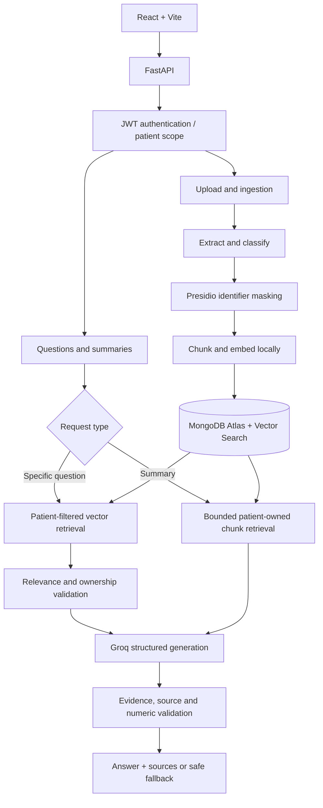

# PatientScope

### Patient-specific medical records assistant · Retrieval-Augmented Generation

**PatientScope** is a full-stack medical-records question-answering application that helps users find information in their own uploaded clinical documents. It uses patient-scoped retrieval, local embeddings, LangGraph orchestration, and Groq-hosted generation to produce answers grounded in document evidence—with source references or a controlled fallback when evidence is insufficient.

> **Project status:** Functional development prototype. Further end-to-end acceptance, privacy, security, and deployment validation are required before use with real patient information. **Not a diagnostic, prescribing, or clinical decision-making system.**

## At a glance

| Layer                  | Technology                                                                              |
| ---------------------- | --------------------------------------------------------------------------------------- |
| Frontend               | React, Vite                                                                             |
| API                    | Python, FastAPI, Pydantic                                                               |
| Workflow orchestration | LangGraph                                                                               |
| Generation             | Groq API (default `openai/gpt-oss-20b`)                                                 |
| Embeddings             | Hugging Face `sentence-transformers/all-MiniLM-L6-v2` (384 dimensions, local inference) |
| Data and retrieval     | MongoDB Atlas, Atlas Vector Search                                                      |
| Authentication         | Argon2 password hashing, HS256 JWT                                                      |
| Identifier masking     | Microsoft Presidio, spaCy                                                               |
| File extraction        | pypdf, python-docx, TXT decoding                                                        |

## Features

- **Patient accounts:** Registration, login, authenticated profile, and ownership checks for protected operations.
- **Medical-record uploads:** PDF, DOCX, and TXT ingestion with size/content validation, automatic or manual categorization, record status, filtering, metadata inspection, and deletion.
- **Clinical question answering:** Questions about prescriptions, laboratory values, clinical notes, claims, procedures, and follow-up instructions.
- **Longitudinal queries:** Compare recorded values across dates and request summaries within configured context limits.
- **Evidence-grounded output:** Source IDs are validated; unsupported, malformed, or insufficiently evidenced answers fall back rather than inventing a response.
- **Patient isolation:** The server derives patient identity from the verified token; retrieval filters and post-retrieval checks enforce ownership.
- **Privacy controls:** Selected identifiers are masked before embedding/storage of text chunks; clinical terminology helps reduce inappropriate masking.
- **Traceable operations:** Request identifiers, timings, and structured error responses facilitate debugging.

## Architecture



### Document ingestion

1. Validate file type, size, MIME information and extracted text.
2. Extract text and infer a document category (or honor an explicitly selected category).
3. Mask selected identifiers with Presidio and spaCy.
4. Split sanitized text into chunks (default **800 characters**, **120-character overlap**).
5. Create 384-dimensional local embeddings and store patient-owned metadata, chunks, and vectors in MongoDB.
6. Mark processing as complete, or record failure and clean up partial chunks.

Supported categories include `prescription`, `lab_report`, `clinical_note`, `claim_document`, `diagnostic_report`, `discharge_summary`, and `other`.

### Question-answering workflow

1. Verify the JWT and resolve the patient on the server.
2. Sanitize and analyze the user's question and optional document-type filter.
3. Retrieve candidate chunks using **patient-filtered Atlas Vector Search**.
4. Recheck ownership, completed status, relevance and requested document type.
5. Use LangGraph to coordinate evidence checks, bounded query rewriting, generation and validation.
6. Reject unsupported citations, suspicious output or inadequately supported facts.
7. Return a cited answer, or: **“The requested information is not available in your uploaded clinical records.”**

Typical retrieval configuration: up to **8 results**, **160 candidates**, and a **0.55 relevance threshold**. These are tunable parameters, not accuracy claims. Query rewriting is bounded to **two rewrites**, with at most **one additional generation attempt** after validation failure.

**Summaries follow a separate path.** Explicit summary requests fetch bounded sets of completed patient-owned chunks instead of relying on top-K semantic retrieval. Current summary limits include up to **30 documents** and **1,000 candidate chunks**, subject to the configured context-size limit. Oversized summaries receive a controlled error.

## Repository layout

```text
PatientScope/
├── backend/
│   ├── app/
│   │   ├── api/             # Authentication, records, chat, health routes
│   │   ├── auth/            # Password hashing and JWT security
│   │   ├── database/        # Persistence and ownership-aware repositories
│   │   ├── rag/             # LangGraph state, nodes and routing
│   │   ├── schemas/         # Request, response and model contracts
│   │   ├── services/        # Extraction, privacy, embeddings, retrieval
│   │   ├── config.py
│   │   └── main.py
│   ├── config/             # Optional clinical terminology extensions
│   ├── .env.example
│   ├── pyproject.toml
│   └── requirements.lock
├── frontend/
│   ├── src/
│   ├── package.json
│   └── vite.config.js
└── README.md
```

## Local setup

### Prerequisites

- Python and Node.js/npm, with compatible versions for the dependency manifests.
- MongoDB Atlas cluster and an Atlas Vector Search index.
- Groq API key.
- Internet access on initial embedding-model download; cached embeddings can later run locally.

### 1. Configure the backend

From the repository root on Windows PowerShell:

```powershell
cd backend
py -m venv .venv
.\.venv\Scripts\Activate.ps1
python -m pip install -r requirements.lock
Copy-Item .env.example .env
```

Edit `backend/.env` and supply **your own** values (never commit this file):

```dotenv
MONGODB_URI=your_private_atlas_connection_string
MONGODB_DB_NAME=medical_rag
JWT_SECRET=generate_a_random_secret_of_at_least_32_bytes
GROQ_API_KEY=your_private_groq_key
LLM_PROVIDER=groq
LLM_MODEL=openai/gpt-oss-20b
EMBEDDING_PROVIDER=huggingface
EMBEDDING_MODEL=sentence-transformers/all-MiniLM-L6-v2
EMBEDDING_DIMENSIONS=384
VECTOR_INDEX_NAME=medical_chunks_hf_384
MAX_CONTEXT_CHARS=24000
```

Create the MongoDB Atlas vector index according to the application's index setup: vector field `embedding`, **384 dimensions**, cosine similarity, and filter fields `patient_id`, `document_type`, `document_id`. Wait until the index is queryable. Index configuration must match the embedding model.

### 2. Run the API

From `backend/` with the virtual environment active:

```powershell
python -m uvicorn app.main:app --reload --port 8000
```

API docs: `http://localhost:8000/docs` · Health: `http://localhost:8000/health` · Readiness: `http://localhost:8000/ready`

### 3. Run the frontend

In another terminal, from the repository root:

```powershell
cd frontend
npm ci
npm run dev
```

Open `http://localhost:5173`. The Vite development configuration proxies API requests to FastAPI. To create a production frontend build, run `npm run build`; the backend can serve the built frontend after restart.

> The steps above follow the documented directory and configuration conventions. They have not been re-executed against a fresh checkout as part of this README rewrite. If dependencies or entry points differ in your latest source tree, use the checked-in manifests and application startup configuration.

## API overview

| Method   | Endpoint                          | Purpose                        |
| -------- | --------------------------------- | ------------------------------ |
| `POST`   | `/api/v1/auth/register`           | Register patient               |
| `POST`   | `/api/v1/auth/login`              | Obtain access token            |
| `GET`    | `/api/v1/auth/me`                 | Current account                |
| `POST`   | `/api/v1/documents/upload`        | Upload and process record      |
| `GET`    | `/api/v1/documents`               | List owned records             |
| `GET`    | `/api/v1/documents/{document_id}` | Owned document metadata        |
| `DELETE` | `/api/v1/documents/{document_id}` | Delete document and its chunks |
| `POST`   | `/api/v1/chat/query`              | Ask records-grounded question  |
| `GET`    | `/health`, `/ready`               | Service checks                 |

## Validation and known limits

Development-snapshot checks documented on **7 October 2026** included **93 passing backend tests** (one optional live test skipped), **10 frontend tests**, **12 development-mode and 12 built-frontend browser checks**, and classification checks on **10 synthetic PDFs**. These are historical development results—not a fresh test of the final cleaned distribution. The latest refinements did **not** undergo a new complete live Groq/Atlas acceptance run.

Limitations to be addressed before broader use:

- No OCR for scanned, image-only PDFs.
- No unbounded or hierarchical summarization of large collections.
- No persistent conversation history; browser refresh clears the in-memory session.
- No original-document archive/viewer or automatic reclassification of existing records.
- No server-side JWT revocation list or demonstrated app-level rate limiter.
- Identifier masking is imperfect; sanitized medical text remains sensitive.
- No completed clinical validation, production security certification, or regulatory compliance assessment.

## Security and responsible use

**Use only synthetic, non-sensitive demo records in public repositories.** Keep `.env`, credentials, real patient information, database dumps, local caches and uploaded documents outside version control. Do not present identifier masking as proof of HIPAA or other regulatory compliance. The application supports retrieval of documented information; it does not provide medical advice.

## Roadmap

- [ ] Finish live end-to-end acceptance testing and performance profiling.
- [ ] Add image-based document OCR.
- [ ] Introduce scalable, validated multi-stage summarization.
- [ ] Add token revocation, rate limiting and stronger operational controls.
- [ ] Improve evaluation coverage, clinical validation and deployment hardening.

---

**Maintainer:** [GitHub — Motokid1](https://github.com/Motokid1)  
**Reference:** Project technical overview, Groq API edition, 7 October 2026.
