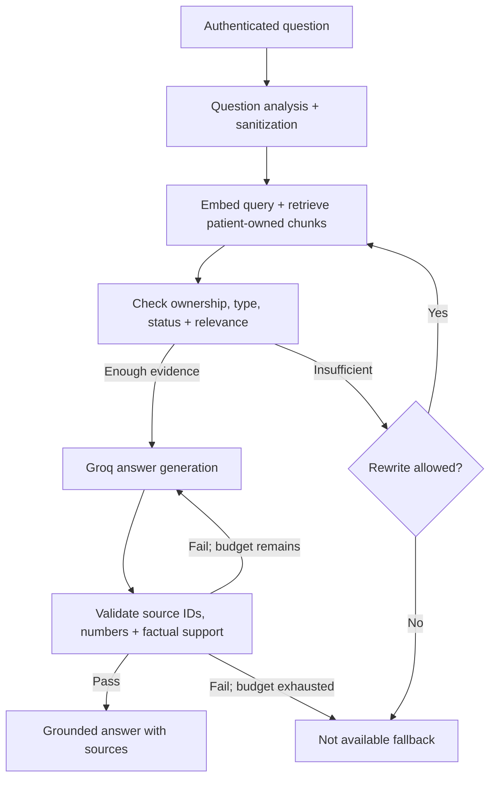

<<<<<<< HEAD
<div align="center">
=======
# Patient Scope 
>>>>>>> 16e8ca332f094d08ceaf7ea5bdc96d4e9311d01a

# PatientScope

### Your medical records, explained with evidence.

<<<<<<< HEAD
**A patient-isolated, document-grounded medical records assistant built with LangGraph, FastAPI, MongoDB Atlas Vector Search, and Groq.**

[](https://www.python.org/)
[](https://fastapi.tiangolo.com/)
[](https://github.com/langchain-ai/langgraph)
[](https://react.dev/)
[](https://www.mongodb.com/products/platform/atlas-vector-search)

**Status:** Functional development prototype · **Inference:** Groq API · **Embeddings:** Local Hugging Face

</div>

> [!IMPORTANT]
> **Demonstration and research project.** PatientScope helps users locate and understand information already documented in their records. It does **not** diagnose conditions, recommend treatment, prescribe medication, or replace a clinician. It has **not** completed production security, privacy compliance, or clinical validation. Use synthetic records for public demonstrations.

## Contents

- [Overview](#overview)
- [Highlights](#highlights)
- [System architecture](#system-architecture)
- [How it works](#how-it-works)
- [Technology stack](#technology-stack)
- [Getting started](#getting-started)
- [Repository structure](#repository-structure)
- [API reference](#api-reference)
- [Security and privacy design](#security-and-privacy-design)
- [Testing and current status](#testing-and-current-status)
- [Limitations and roadmap](#limitations-and-roadmap)

## Overview

Clinical records are often spread across prescriptions, laboratory results, consultation notes, discharge summaries, and insurance claims. Finding a specific dose, comparing results across visits, or reconstructing a documented follow-up plan can require reading many files.

**PatientScope** turns uploaded medical documents into a private, searchable knowledge base. After signing in, a patient uploads records and asks natural-language questions. A **retrieval-augmented generation (RAG)** workflow searches _only that patient's completed records_, checks the evidence, and returns a source-linked response or an explicit insufficient-evidence fallback.

**Example questions**

- “What dose of atorvastatin was documented in my prescription?”
- “How did my HbA1c change between January and April?”
- “What follow-up instructions appear in my consultation notes?”
- “Summarize my uploaded laboratory reports.”

## Highlights

| Capability                       | Implementation                                                                                                            |
| -------------------------------- | ------------------------------------------------------------------------------------------------------------------------- |
| **Patient-scoped access**        | JWT-authenticated identity drives database queries; retrieval results are ownership-checked again before use.             |
| **Multi-format ingestion**       | PDF, DOCX, and TXT extraction; validation, classification, processing status, and record deletion.                        |
| **Privacy preprocessing**        | Microsoft Presidio + spaCy mask selected personal identifiers before sanitized chunks are embedded and persisted.         |
| **Local semantic embeddings**    | `sentence-transformers/all-MiniLM-L6-v2` generates 384-dimensional vectors on the application host.                       |
| **Structured RAG orchestration** | LangGraph coordinates retrieval, relevance checks, bounded rewriting, generation, and answer validation.                  |
| **Source-aware answers**         | Citations are validated against retrieved documents; numbers and supporting evidence receive additional checks.           |
| **Dedicated summary path**       | Explicit summary requests search bounded sets of completed records rather than relying on only top-K semantic hits.       |
| **Observable failures**          | Request IDs, stage timings, and controlled error codes help distinguish data, retrieval, provider, and validation issues. |

## System architecture

GitHub renders the following **Mermaid architecture diagram** directly in this README.

```mermaid
flowchart TB
    U[Patient / Browser] --> WEB[React + Vite UI]
    WEB -->|HTTPS / REST + Bearer JWT| API[FastAPI API]
    API --> AUTH[Argon2 + JWT verification]
    AUTH --> SCOPE[Resolve authenticated patient ID]

    subgraph ING[Document ingestion]
      direction TB
      UP[Upload PDF / DOCX / TXT] --> FILE[Validate file + extract text]
      FILE --> CLASS[Detect / select record category]
      CLASS --> PII[Presidio + spaCy identifier masking]
      PII --> CHUNK[Chunk sanitized content]
      CHUNK --> EMB[Local Hugging Face embeddings]
      EMB --> SAVE[Persist chunks, vectors + metadata]
    end

    subgraph RAG[LangGraph question and summary workflow]
      direction TB
      ASK[Question + optional document filter] --> ROUTE{Summary request?}
      ROUTE -->|No| VECTOR[Patient-filtered vector search]
      VECTOR --> GRADE[Ownership + relevance checks]
      GRADE -->|Insufficient evidence| REWRITE{Rewrite budget available?}
      REWRITE -->|Yes| VECTOR
      REWRITE -->|No| FALL[Controlled fallback]
      GRADE -->|Relevant| GENERATE[Groq structured generation]
      ROUTE -->|Yes| SUM[Bounded completed-record retrieval]
      SUM --> GENERATE
      GENERATE --> VERIFY[Validate citations, numbers + support]
      VERIFY -->|Valid| ANSWER[Answer + document sources]
      VERIFY -->|Invalid / retries exhausted| FALL
    end

    SCOPE --> UP
    SCOPE --> ASK

    SAVE --> DB[(MongoDB Atlas: patients / documents / medical_chunks)]
    DB --> VECTOR
    DB --> SUM
    DB --> AUTH
    GENERATE <-->|LLM API| GROQ[Groq model]
    ANSWER --> API
    FALL --> API
    API --> WEB

    classDef storage fill:#eaf4ef,stroke:#277454,color:#183b2b;
    classDef model fill:#edf2fc,stroke:#4d6fb5,color:#1f3157;
    class DB storage;
    class GROQ,EMB model;
=======
```text
Patient Scope/
  frontend/     React source, public assets, package files and Vite configuration
  backend/      API source, glossary configuration, dependency files and .env.example
  README.md     Setup and run commands
>>>>>>> 16e8ca332f094d08ceaf7ea5bdc96d4e9311d01a
```

**Trust boundary:** The frontend cannot choose an arbitrary patient ID for retrieval. The backend derives ownership from a validated token and rechecks documents and chunks after retrieval. This is defense-in-depth, not a claim of certified security.

### Document ingestion pipeline

<<<<<<< HEAD
```mermaid
flowchart LR
    A[Upload] --> B[Format / size checks]
    B --> C[Text extraction]
    C --> D[Document classification]
    D --> E[Mask selected identifiers]
    E --> F[800-character chunks / 120 overlap]
    F --> G[384D local embeddings]
    G --> H[(MongoDB Atlas)]
    H --> I[Processing completed]
    B -. Invalid .-> X[Controlled error]
    C -. Extraction failure .-> X
=======
Use Windows PowerShell with Python 3.11 and Node.js 22.12 or newer.
Replace the path with your extracted project location.

```powershell
cd "D:\Projects - AI\Patient Scope\backend"
py -3.11 -m venv .venv
& ".\.venv\Scripts\python.exe" -m pip install --upgrade pip "setuptools>=77.0.3"
& ".\.venv\Scripts\python.exe" -m pip install torch==2.14.1 --index-url https://download.pytorch.org/whl/cpu
& ".\.venv\Scripts\python.exe" -m pip install -c requirements.lock -c requirements-huggingface.lock -e ".[huggingface]"
& ".\.venv\Scripts\python.exe" -m pip install -c requirements.lock https://github.com/explosion/spacy-models/releases/download/en_core_web_sm-3.8.0/en_core_web_sm-3.8.0-py3-none-any.whl
>>>>>>> 16e8ca332f094d08ceaf7ea5bdc96d4e9311d01a
```

Supported record categories: `prescription`, `lab_report`, `clinical_note`, `claim_document`, `diagnostic_report`, `discharge_summary`, `other`.

- The application validates file types, MIME expectations, nonempty content, and extracted-text size.
- Default upload size: **15 MB** per file; maximum extracted text: **2,000,000 characters**.
- Failed processing marks the record as failed and removes partial chunks.
- **Scanned image-only PDFs are not supported** because OCR is not implemented.

### Evidence-gated question answering



The _specific-question_ path typically retrieves up to **8** chunks from **160** candidates with a configured relevance threshold of **0.55**. These are settings, **not measured accuracy claims**. Defaults permit up to **2 query rewrites** and **1 additional generation attempt** following failed validation.

**Summary requests use a separate retrieval strategy:** explicit requests for a summary, recap, overview, or history retrieve completed patient-owned chunks subject to context bounds (up to **30 documents** and **1,000 candidate chunks**). Oversized requests produce `SUMMARY_TOO_LARGE`; hierarchical summarization is not yet implemented.

If evidence or validation is insufficient, the response is:

> The requested information is not available in your uploaded clinical records.

This fallback means the workflow did not find _sufficient validated evidence_; it does not prove a fact is absent from the original document.

## How it works

1. **Register and authenticate.** Passwords are hashed with Argon2; successful login issues a signed HS256 JWT.
2. **Upload a record.** FastAPI extracts text, categorizes it, masks selected identifiers, chunks it, generates local embeddings, and stores patient-owned metadata and vectors.
3. **Ask a question.** LangGraph analyzes the request and selects question answering or summary retrieval.
4. **Retrieve evidence.** MongoDB Atlas Vector Search uses patient and document filters; server-side logic rechecks ownership and completed processing status.
5. **Generate and verify.** Groq produces a structured answer, followed by citation, identifier, numeric, and evidence-support checks.
6. **Display the result.** React shows the answer, source references, or a controlled fallback, with loading and error states.

**Current frontend:** account screens, document dashboard and management, record categorization, chat with document filters and suggested questions, citations, and responsive layout. Session and chat state remain in memory; refresh signs the user out.

## Technology stack

| Layer              | Technology                                              | Why it is used                                                |
| ------------------ | ------------------------------------------------------- | ------------------------------------------------------------- |
| UI                 | React, Vite                                             | Patient account, documents, and chat interface                |
| API and validation | Python, FastAPI, Pydantic                               | Typed request/response contracts and REST services            |
| AI workflow        | LangGraph                                               | Branching, state, retries, and validation stages              |
| LLM                | Groq API — `openai/gpt-oss-20b` default                 | Structured query analysis and evidence-based responses        |
| Embeddings         | Hugging Face Sentence Transformers — `all-MiniLM-L6-v2` | Local 384D semantic representations                           |
| Database           | MongoDB Atlas + Atlas Vector Search                     | Patient records, chunk metadata, and filtered semantic search |
| Privacy processing | Microsoft Presidio, spaCy                               | Selected identifier masking before vector storage             |
| Security           | Argon2, HS256 JWT                                       | Password hashing and patient authentication                   |
| Extraction         | pypdf, python-docx                                      | PDF and DOCX text extraction                                  |

### Data model and search index

- `patients` — account identity, password hash, role, and active state.
- `documents` — patient ownership, record category/date, processing state, and chunk count.
- `medical_chunks` — chunk content (sanitized), document links, ownership fields, and embedding vectors.

The Atlas Vector Search index uses an `embedding` vector field with **384 dimensions**, **cosine similarity**, and filter fields `patient_id`, `document_type`, and `document_id`. An index must finish building before semantic retrieval works. Changing embedding models requires **re-embedding** existing records.

## Getting started

> These commands follow the documented Groq-edition project layout. Validate them against your checked-in dependency files before publishing; this README revision does not constitute a fresh installation test.

### Prerequisites

- Python and Node.js/npm versions compatible with the checked-in project manifests.
- A MongoDB Atlas connection and a queryable Atlas Vector Search index.
- A Groq API key.
- Network access for initial Sentence Transformers model download and Groq inference.

### 1. Clone the repository

```powershell
git clone https://github.com/Motokid1/PatientScope.git
cd PatientScope
```

### 2. Configure the FastAPI backend

```powershell
cd backend
py -m venv .venv
.\.venv\Scripts\Activate.ps1
python -m pip install -r requirements.lock
Copy-Item .env.example .env
```

Edit **`backend/.env`**, keeping secrets out of Git:

```dotenv
MONGODB_URI=your_private_mongodb_atlas_connection_string
MONGODB_DB_NAME=medical_rag
JWT_SECRET=replace_with_a_random_secret_of_at_least_32_bytes
GROQ_API_KEY=your_private_groq_api_key
LLM_PROVIDER=groq
LLM_MODEL=openai/gpt-oss-20b
EMBEDDING_PROVIDER=huggingface
EMBEDDING_MODEL=sentence-transformers/all-MiniLM-L6-v2
EMBEDDING_DIMENSIONS=384
VECTOR_INDEX_NAME=medical_chunks_hf_384
MAX_CONTEXT_CHARS=24000
```

The Atlas Vector Search index name and dimensions must match your application configuration. Wait for the vector index to become queryable. JWT secret must be at least 32 bytes.

Start the API:

```powershell
python -m uvicorn app.main:app --reload --port 8000
```

- API documentation: http://localhost:8000/docs
- Basic health: http://localhost:8000/health
- Database readiness: http://localhost:8000/ready

### 3. Start the React interface

Open another terminal from the repository root:

```powershell
<<<<<<< HEAD
cd frontend
=======
& ".\.venv\Scripts\python.exe" -m uvicorn app.main:app --host 127.0.0.1 --port 8000 --no-access-log
```

Keep this terminal open. API documentation is at http://127.0.0.1:8000/docs.
For subsequent runs, this is the only backend command required.

## 6. Start the frontend in a second terminal

```powershell
cd "D:\Projects - AI\Patient Scope\frontend"
>>>>>>> 16e8ca332f094d08ceaf7ea5bdc96d4e9311d01a
npm ci
npm run dev
```

Open **http://localhost:5173**. Vite proxies backend API requests during development. For a frontend build run `npm run build`; the backend can serve the built frontend after restart.

## Repository structure

```text
PatientScope/
├── backend/
│   ├── app/
│   │   ├── api/              # Authentication, records and chat routes
│   │   ├── auth/             # Argon2 and JWT
│   │   ├── database/         # Patient-scoped persistence
│   │   ├── rag/              # LangGraph nodes, state, branching and retries
│   │   ├── schemas/          # Typed request and model contracts
│   │   ├── services/         # Parsing, privacy, embeddings and retrieval
│   │   ├── config.py         # Validated environment settings
│   │   ├── observability.py  # Request identifiers and timings
│   │   └── main.py           # FastAPI application
│   ├── config/               # Optional clinical terminology additions
│   ├── .env.example          # Safe configuration template
│   ├── pyproject.toml
│   └── requirements.lock
├── frontend/
│   ├── src/                  # React app, state and API client
│   ├── public/
│   ├── package.json
│   └── vite.config.js
└── README.md
```

## API reference

| Method   | Endpoint                          | Description                          |
| -------- | --------------------------------- | ------------------------------------ |
| `POST`   | `/api/v1/auth/register`           | Create a patient account             |
| `POST`   | `/api/v1/auth/login`              | Authenticate and receive JWT         |
| `GET`    | `/api/v1/auth/me`                 | Get authenticated profile            |
| `POST`   | `/api/v1/documents/upload`        | Upload and process a medical record  |
| `GET`    | `/api/v1/documents`               | List the signed-in patient's records |
| `GET`    | `/api/v1/documents/{document_id}` | View owned document metadata         |
| `DELETE` | `/api/v1/documents/{document_id}` | Delete owned document and chunks     |
| `POST`   | `/api/v1/chat/query`              | Ask a document-grounded question     |
| `GET`    | `/api/v1/ui/config`               | Non-secret UI settings               |
| `GET`    | `/health`                         | Basic service health                 |
| `GET`    | `/ready`                          | Database readiness                   |
| `GET`    | `/docs`                           | Swagger interactive documentation    |

Successful chat responses include `answer`, `status`, `sources`, and `request_id`. Application errors expose controlled codes and request references rather than raw provider secrets.

## Security and privacy design

**Defense-in-depth controls included in the prototype:**

- **Server-derived identity:** patient ID originates from the verified JWT, not a client-supplied retrieval scope.
- **Layered record isolation:** ownership filters at database/vector query time plus post-retrieval checks.
- **Password protection:** Argon2 password hashing and HS256-signed JWTs; default access-token lifetime is 60 minutes.
- **Sensitive text preprocessing:** selected identifiers are masked before clinical chunks and embeddings are persisted.
- **Grounding controls:** source ID checks, number checks, suspicious-output checks, and model-assisted evidence assessment.
- **Bounded retries and inputs:** upload limits, context limits, constrained rewriting, and controlled exception handling.
- **Operational diagnostics:** request IDs and stage timings without intentionally logging clinical payloads or API keys.

**Important boundaries:** Presidio masking is not guaranteed to identify every PHI field; masked records remain sensitive health data. Account information remains in protected patient storage. Logging out does not revoke an already issued token server-side. The application is **not certified HIPAA-compliant** and should not be exposed to real-world patient workflows without independent security, privacy, and clinical reviews.

## Testing and current status

The **7 October 2026 technical project snapshot** recorded the following development-stage verification:

| Check                      | Recorded result                                               | Scope                                   |
| -------------------------- | ------------------------------------------------------------- | --------------------------------------- |
| Backend automated tests    | **93 passed**, 1 optional live test skipped                   | Earlier tested development snapshot     |
| Frontend tests             | **10 passed**                                                 | Client behavior, rendering and sessions |
| Browser workflow checks    | **12 development + 12 built-frontend checks passed**          | Tested UI flows                         |
| Document classification    | **10 synthetic PDFs reviewed**                                | Expected categories                     |
| Ownership in summary graph | Test covered 10 records and excluded another patient's record | Development-only test                   |

These are **historical development results**, not a newly executed full test suite. The latest provider-error refinements and final clean package did **not** receive another complete live Groq/Atlas acceptance run. There is no published clinical-accuracy score, production SLA, or verified compliance assessment.

## Limitations and roadmap

**Current known limitations**

- Scanned/image-only PDFs need OCR.
- Very large record collections require hierarchical summarization; current summary retrieval is bounded.
- Conversations are held in browser memory, with no persistent chat history.
- Original PDFs are not archived for in-app viewing after ingestion.
- Existing documents are not automatically reclassified after classification-rule changes.
- No server-side token revocation list, password reset, or demonstrated application-level rate limiter.
- Groq availability, quota, and Atlas availability affect live answers.
- Identifier masking and evidence validation can make mistakes; professional clinical use has not been validated.

**Planned improvements**

- [ ] Execute full live Groq + Atlas end-to-end acceptance and load testing.
- [ ] Add OCR with clear confidence/error handling for scanned clinical records.
- [ ] Support hierarchical, cited summaries for larger record collections.
- [ ] Add persistent, privacy-aware conversation history and session revocation.
- [ ] Expand regression tests for cross-patient isolation, prompt injection, numeric accuracy, and document changes.
- [ ] Strengthen rate limiting, operational monitoring, and deployment security.

## Responsible use

**Do not commit actual patient documents, PHI, credentials, `.env` files, Atlas exports, or runtime artifacts to this repository.** Use synthetic medical documents and dummy patient accounts in screenshots and demos. PatientScope is a **records-assistance tool**, not a diagnostic or treatment system.

---

<div align="center">

Built to explore **patient-scoped RAG · secure AI workflows · evidence-grounded generation**.

**Maintainer:** [Motokid1](https://github.com/Motokid1) · **Technical reference:** Groq-edition project overview, 7 October 2026

</div>
